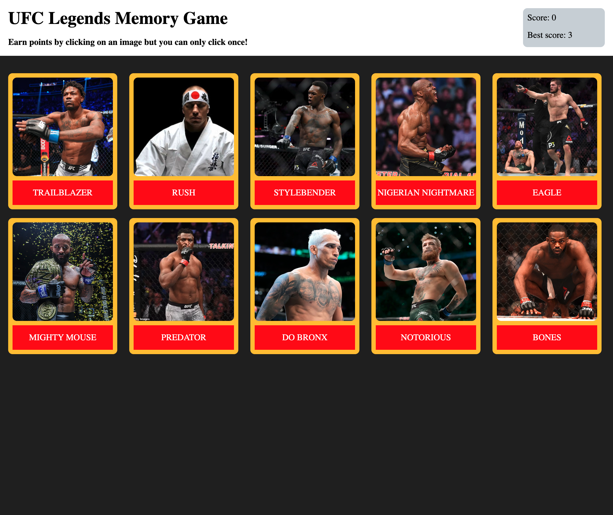

# Memory-Card-Game

## [Live Demo](https://salvantjeff.github.io/Memory-Card-Game/)

## Introduction 

The main goal of this project was to continue to develop and practice using functional components, hooks (useState and useEffect), lifecycle methods as well as state to create React applications. Brainstormed and planned the gameplay and how to structure the data to be used, helping in reducing errors. 

Creating a memory card game really solidified my ability to create interactive applications by updating complex objects in state and arrays in state. My skills were sharpened on how to manage React states (like the amount of clicked each card has received as well as the total score the user accumulated).

